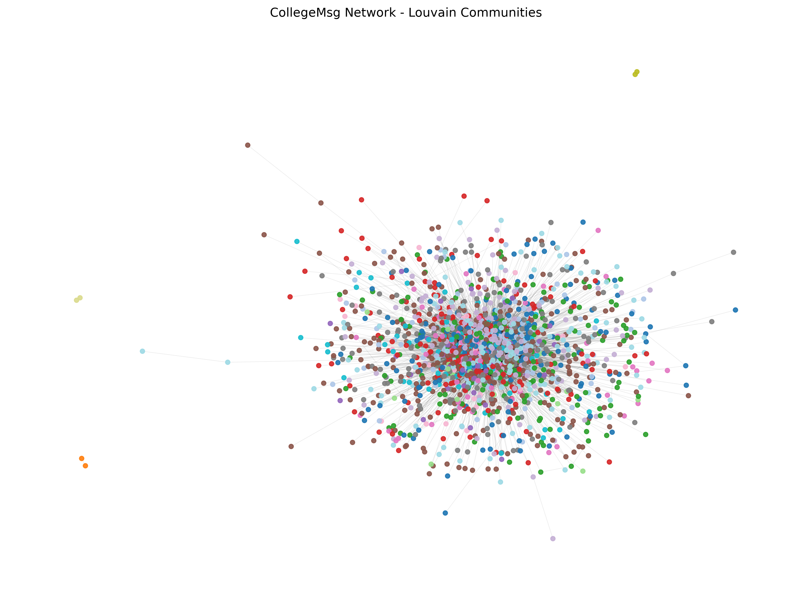
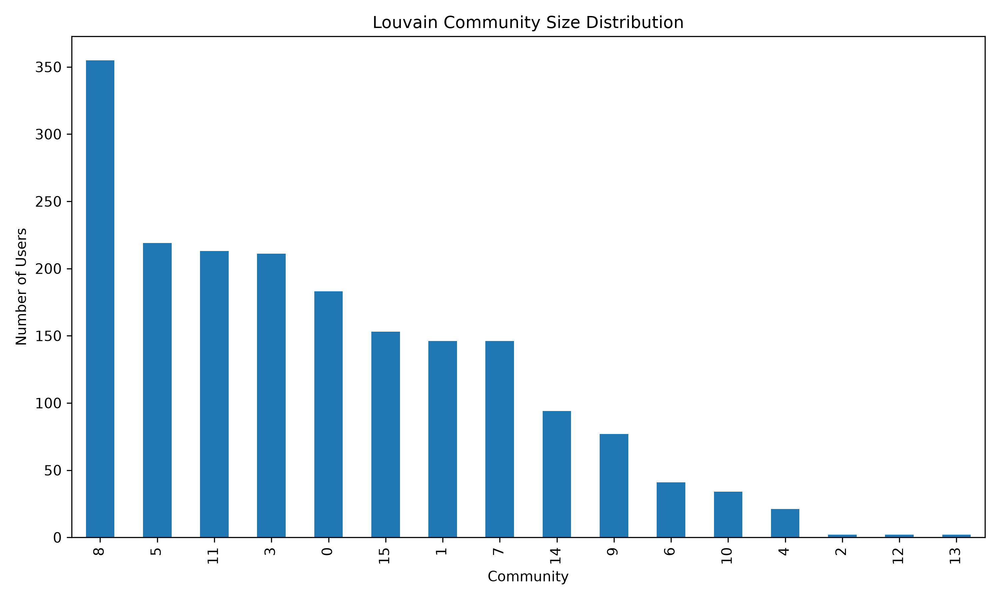
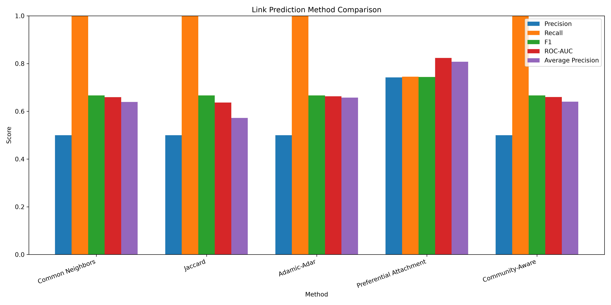

# CommLink

## Community Detection and Temporal Link Prediction in Social Networks

CommLink is a network analysis and link prediction project that studies how **community structure and network topology can be used to predict future interactions in a social network**.

The project uses the temporal **CollegeMsg** dataset to construct an interaction network, identify communities using the Louvain algorithm, and evaluate multiple link prediction techniques on future interactions.

The central objective is to investigate:

> **Can community information provide useful signals for predicting future links in an evolving social network?**

---

## ✨ Overview

Social networks are dynamic systems in which relationships continuously form and evolve.

Given a network observed up to a particular point in time, **temporal link prediction** attempts to predict which pairs of users will establish a new connection in the future.

CommLink approaches this problem through two complementary signals:

- **Structural information** — how users are connected within the network.
- **Community information** — whether users belong to the same densely connected group.

The project compares four classical link prediction algorithms with a community-aware approach:

| Category | Method |
|---|---|
| Structural baseline | Common Neighbors |
| Structural baseline | Jaccard Similarity |
| Structural baseline | Adamic-Adar |
| Structural baseline | Preferential Attachment |
| Proposed approach | Community-Aware Link Prediction |

The evaluation uses a **chronological train/test split**, ensuring that future interactions are not used when constructing the observed network or its communities.

---

## 🔬 Research Objective

The project investigates whether incorporating community structure provides additional information for temporal link prediction beyond traditional structural similarity measures.

Specifically, the project:

1. Constructs a social interaction network from timestamped communication data.
2. Performs basic network analysis.
3. Detects communities using Louvain community detection.
4. Splits the interaction history chronologically.
5. Identifies genuinely new links appearing in the future.
6. Applies four classical link prediction algorithms.
7. Applies a community-aware prediction method using Louvain assignments.
8. Evaluates all methods using multiple classification and ranking metrics.
9. Compares their performance through tables and visualizations.

---

# 📊 Dataset

CommLink uses the **CollegeMsg dataset**, a temporal dataset containing interactions between users in a college social network.

Each interaction contains:

```text
source    target    timestamp
```

where `source` and `target` represent users and `timestamp` represents the time of the interaction.

### Dataset statistics

| Property | Value |
|---|---:|
| Total interactions | 59,835 |
| Unique users | 1,899 |
| Unique undirected edges | 13,838 |
| Start | 15 April 2004 |
| End | 26 October 2004 |

The raw dataset is **not included in the repository**.

Place the dataset at:

```text
data/raw/CollegeMsg.txt
```

If the downloaded dataset is compressed:

```bash
gunzip CollegeMsg.txt.gz
```

and place the extracted file in `data/raw/`.

---

# 🏗️ Pipeline

The complete CommLink pipeline is:

```text
                    CollegeMsg Dataset
                           │
                           ▼
                  Data Preprocessing
                           │
                           ▼
                 Interaction Network
                           │
             ┌─────────────┴─────────────┐
             │                           │
             ▼                           ▼
      Network Analysis            Community Detection
                                      │
                                      ▼
                              Louvain Communities
             │                           │
             └─────────────┬─────────────┘
                           │
                           ▼
                  Temporal Train/Test
                         Split
                           │
                 ┌─────────┴─────────┐
                 │                   │
                 ▼                   ▼
          Training Network       Future Links
                 │                   │
                 ▼                   ▼
        Link Prediction        Ground Truth
                 │
       ┌─────────┼──────────┐
       │         │          │
       ▼         ▼          ▼
   Classical  Community   Evaluation
   Methods    Aware       Metrics
       │         │          │
       └─────────┴──────────┘
                 │
                 ▼
          Results & Plots
```

---

# 1. Data Preprocessing

The raw CollegeMsg interaction file is cleaned and transformed into a structured dataset.

The preprocessing stage:

- removes missing values
- converts user IDs to integers
- converts timestamps to integers
- converts Unix timestamps to datetime values
- sorts all interactions chronologically
- reports dataset statistics

Run:

```bash
python3 src/preprocessing/preprocess.py
```

This generates:

```text
data/processed/college_msg_processed.csv
```

---

# 2. Network Construction

The processed interactions are represented as a weighted undirected graph using NetworkX.

### Nodes

Each user represents a node.

### Edges

An interaction between two users creates an edge.

### Edge weights

Repeated interactions between the same pair increase the weight of their edge.

Conceptually:

```text
User → Node
Interaction → Edge
Repeated interaction → Increased edge weight
```

The resulting full network contains:

```text
1,899 nodes
13,838 unique edges
59,835 interactions
```

Run:

```bash
python3 src/network/build_graph.py
```

---

# 3. Network Analysis

CommLink performs basic analysis of the resulting interaction network.

The analysis includes:

- number of nodes
- number of edges
- network density
- average degree
- number of connected components
- largest connected component
- smallest connected component
- minimum degree
- maximum degree

Run:

```bash
python3 src/network/network_analysis.py
```

---

# 4. Community Detection

Social networks frequently contain groups of users that interact more heavily with one another than with the rest of the network.

CommLink identifies these groups using **Louvain community detection**.

The Louvain algorithm is applied to the interaction network using edge weights.

A fixed random seed is used for reproducibility:

```python
random_state=42
```

The current network produces:

```text
16 communities
```

with a modularity of approximately:

```text
0.36
```

Run:

```bash
python3 src/communities/community_detection.py
```

The resulting assignments are stored as:

```text
data/processed/louvain_communities.csv
```

---

## Community Structure

The project generates visualizations of the detected communities.

### Louvain community network



### Community size distribution



These visualizations provide an overview of the structural organization of the interaction network.

---

# 5. Temporal Train/Test Split

A key part of CommLink is that link prediction is evaluated **temporally rather than through a random edge split**.

All interactions are first sorted chronologically.

The earlier interactions form the observed/training network, while later interactions represent the future.

The current experiment uses an 80/20 temporal split:

| Split | Interactions |
|---|---:|
| Training | 47,868 |
| Future/Test | 11,967 |
| Total | 59,835 |

### Training period

```text
2004-04-15 14:56:01
        ↓
2004-06-11 03:02:02
```

### Test period

```text
2004-06-11 03:09:04
        ↓
2004-10-26 07:52:22
```

The training graph contains:

```text
1,677 nodes
11,612 edges
```

Only the training graph is used when computing prediction scores.

This prevents future network information from leaking into the prediction process.

---

# 6. Future New Links

Not every interaction occurring during the future period represents a new relationship.

If two users were already connected in the training graph, their future interaction does not constitute a new link.

Therefore, CommLink identifies future links that:

1. occur during the future period, and
2. did not exist in the training network.

The current experiment contains:

```text
1,366 future new links
```

An equal number of negative candidate links are sampled for evaluation:

```text
Positive links: 1,366
Negative links: 1,366
```

For the structural link prediction methods, both endpoints of a candidate link must already exist in the observed training network.

---

# 7. Link Prediction Methods

## Common Neighbors

Common Neighbors predicts links based on the number of neighbors shared by two users.

For users \(u\) and \(v\):

```text
CN(u,v) = |N(u) ∩ N(v)|
```

A larger number of shared neighbors indicates greater structural similarity.

---

## Jaccard Similarity

Jaccard Similarity normalizes common neighbors according to the total neighborhood size:

```text
J(u,v) = |N(u) ∩ N(v)|
         ----------------
         |N(u) ∪ N(v)|
```

This reduces the influence of highly connected users.

---

## Adamic-Adar

Adamic-Adar gives more weight to uncommon common neighbors.

A common neighbor with a smaller degree contributes more to the score than a highly connected common neighbor.

Conceptually:

```text
AA(u,v) = Σ 1 / log(degree(w))
```

over common neighbors \(w\).

---

## Preferential Attachment

Preferential Attachment models the tendency of highly connected nodes to form new connections.

The score is:

```text
PA(u,v) = degree(u) × degree(v)
```

This provides a useful baseline for networks where high-degree users are more likely to form additional connections.

---

# 8. Community-Aware Link Prediction

The main extension in CommLink incorporates the community structure discovered by Louvain into link prediction.

Traditional structural predictors primarily consider the topology surrounding two candidate users.

The community-aware method additionally considers their community membership.

Conceptually:

```text
                Candidate Link
                      │
            ┌─────────┴─────────┐
            ▼                   ▼
     Structural Signal    Community Signal
            │                   │
            └─────────┬─────────┘
                      ▼
             Community-Aware
                  Score
```

The communities are learned **only from the training graph**.

This means that information from future interactions is not used when constructing the community assignments used for prediction.

Implementation:

```text
src/link_prediction/community_aware.py
```

---

# 9. Evaluation

Each method is evaluated using:

- Precision
- Recall
- F1 Score
- ROC-AUC
- Average Precision

## Precision

Measures the proportion of predicted links that are actually future links.

## Recall

Measures the proportion of actual future links that are successfully predicted.

## F1 Score

The harmonic mean of Precision and Recall.

## ROC-AUC

Measures how well the prediction scores distinguish positive and negative candidate links across ranking thresholds.

## Average Precision

Measures ranking quality through the precision-recall relationship and is useful for evaluating link prediction scores.

---

## Top-K Evaluation

For Precision, Recall and F1, the experiment ranks candidate links according to their prediction scores.

The top \(K\) candidates are treated as predicted links, where:

```text
K = number of positive future links
```

This makes the evaluation consistent across all methods.

ROC-AUC and Average Precision are calculated directly from the continuous prediction scores.

---

# 📈 Results

The current experiment generates the complete comparison automatically.

The results are stored in:

```text
results/tables/link_prediction_results.csv
```

The current experiment produced:

| Method | Precision | Recall | F1 | ROC-AUC | Average Precision |
|---|---:|---:|---:|---:|---:|
| Common Neighbors | 0.787 | 0.787 | 0.787 | 0.659 | 0.639 |
| Jaccard | 0.787 | 0.787 | 0.787 | 0.637 | 0.572 |
| Adamic-Adar | 0.787 | 0.787 | 0.787 | 0.663 | 0.658 |
| Preferential Attachment | 0.744 | 0.744 | 0.744 | **0.823** | **0.808** |
| Community-Aware | 0.787 | 0.787 | 0.787 | 0.660 | 0.641 |

> **Note:** These values represent the current experimental configuration. They are not intended as universal performance claims for the algorithms.

### Link prediction comparison



The experiment allows the structural baselines and community-aware method to be compared using both classification-oriented and ranking-oriented metrics.

In the current run, Preferential Attachment obtains the highest ROC-AUC and Average Precision among the evaluated methods.

The community-aware approach provides a direct experimental test of whether adding community membership information changes predictive performance relative to the structural baselines.

---

# 📁 Project Structure

```text
CommLink/
│
├── data/
│   ├── raw/
│   │   └── CollegeMsg.txt
│   │
│   └── processed/
│       ├── college_msg_processed.csv
│       └── louvain_communities.csv
│
├── src/
│   │
│   ├── preprocessing/
│   │   └── preprocess.py
│   │
│   ├── network/
│   │   ├── build_graph.py
│   │   └── network_analysis.py
│   │
│   ├── communities/
│   │   ├── community_detection.py
│   │   ├── community_network.py
│   │   ├── community_summary.py
│   │   └── community_visualization.py
│   │
│   ├── link_prediction/
│   │   ├── baselines.py
│   │   ├── community_aware.py
│   │   └── run_experiment.py
│   │
│   └── evaluation/
│       ├── temporal_split.py
│       └── metrics.py
│
├── results/
│   ├── figures/
│   │   ├── community_size_distribution.png
│   │   ├── louvain_community_network.png
│   │   └── link_prediction_comparison.png
│   │
│   └── tables/
│       ├── community_summary.csv
│       ├── link_prediction_results.csv
│       └── training_louvain_communities.csv
│
├── .gitignore
├── requirements.txt
└── README.md
```

---

# ⚙️ Installation

## Requirements

- Python 3.10+
- pip
- NetworkX
- Pandas
- NumPy
- scikit-learn
- python-louvain
- Matplotlib

### Clone the repository

```bash
git clone https://github.com/nandita-rajesh/CommLink.git
cd CommLink
```

### Create a virtual environment

```bash
python3 -m venv venv
source venv/bin/activate
```

### Install dependencies

```bash
pip install -r requirements.txt
```

---

# 🚀 Running the Project

## 1. Prepare the dataset

Create the raw-data directory:

```bash
mkdir -p data/raw
```

Place:

```text
CollegeMsg.txt
```

inside:

```text
data/raw/
```

---

## 2. Preprocess the dataset

```bash
python3 src/preprocessing/preprocess.py
```

---

## 3. Build the network

```bash
python3 src/network/build_graph.py
```

---

## 4. Perform network analysis

```bash
python3 src/network/network_analysis.py
```

---

## 5. Detect communities

```bash
python3 src/communities/community_detection.py
```

---

## 6. Run link prediction

The complete temporal link prediction experiment can be run using:

```bash
python3 -m src.link_prediction.run_experiment
```

This automatically performs:

```text
Temporal Split
      ↓
Training Graph Construction
      ↓
Future New-Link Extraction
      ↓
Negative Sampling
      ↓
Louvain Community Detection
      ↓
Classical Link Prediction
      ↓
Community-Aware Prediction
      ↓
Metric Evaluation
      ↓
Results Table
      ↓
Comparison Plot
```

---

# 📦 Generated Outputs

After running the complete experiment, the following files are generated:

```text
results/
├── figures/
│   ├── community_size_distribution.png
│   ├── louvain_community_network.png
│   └── link_prediction_comparison.png
│
└── tables/
    ├── community_summary.csv
    ├── link_prediction_results.csv
    └── training_louvain_communities.csv
```

### Results table

```text
results/tables/link_prediction_results.csv
```

contains the numerical evaluation results.

### Community assignments

```text
results/tables/training_louvain_communities.csv
```

contains the Louvain community assigned to each training-network user.

### Visualizations

The `results/figures/` directory contains the generated visualizations for:

- community structure
- community size distribution
- link prediction performance

---

# 🔁 Reproducibility

CommLink uses deterministic settings wherever possible.

Louvain community detection uses:

```python
random_state=42
```

Random sampling used during evaluation is also controlled to make experiments reproducible.

To reproduce the current experiment:

```bash
python3 src/preprocessing/preprocess.py
python3 -m src.link_prediction.run_experiment
```

using the same CollegeMsg dataset and project configuration.

---

# ⚠️ Limitations

The current implementation has several limitations.

### Static community assignments

Communities are detected from the training network and remain fixed during the future prediction period.

In a real evolving network, communities may themselves change over time.

### Undirected representation

The interaction network is represented as an undirected graph.

The direction of individual messages is therefore not modeled during link prediction.

### Candidate sampling

The evaluation uses a balanced set of positive and negative candidate links rather than evaluating every possible pair of users.

### Single dataset

The experiments currently use the CollegeMsg dataset.

Results may therefore not generalize directly to other social networks.

### Classical predictors

The current implementation focuses on interpretable graph-based predictors rather than graph embeddings or neural network models.

---

# 🔮 Future Work

Several extensions can build upon the current implementation.

### Dynamic communities

Instead of calculating communities once from the training network, community assignments could be updated as new interactions arrive.

### Temporal community evolution

Track how users move between communities and how community structure changes over time.

### Time-aware link prediction

Give greater importance to recent interactions through temporal decay.

### Directed link prediction

Model sender and receiver relationships separately rather than treating interactions as undirected.

### Weighted link prediction

Explicitly incorporate interaction frequency into prediction scores.

### Graph embeddings

Compare classical predictors with node embeddings such as:

- Node2Vec
- DeepWalk
- GraphSAGE

### Temporal Graph Neural Networks

A future extension could investigate temporal graph neural networks for predicting evolving relationships.

### Multiple temporal windows

Instead of using a single 80/20 split, evaluate the methods across multiple historical windows to determine whether the results remain consistent over time.

---

# 🧪 Research Extensions

The project is designed to serve as a foundation for investigating more advanced questions around evolving social networks.

A particularly interesting direction is **dynamic community-aware link prediction**:

```text
t₁ → Network + Communities
          │
          ▼
       Predict
          │
          ▼
t₂ → New interactions
          │
          ▼
   Update communities
          │
          ▼
       Predict
          │
          ▼
t₃ → ...
```

This would allow both the network and its community structure to evolve throughout the prediction process.

---

# 🛠️ Technologies

CommLink is implemented using:

- **Python**
- **Pandas** — data processing
- **NumPy** — numerical computation
- **NetworkX** — graph construction and structural link prediction
- **python-louvain** — community detection
- **scikit-learn** — evaluation metrics
- **Matplotlib** — visualization

---

# 👥 Contributors

<table>
  <tr>
    <td align="center">
      <b>Chinmay Ajith</b>
    </td>
    <td align="center">
      <b>Nandita Rajesh</b>
    </td>
  </tr>
</table>

---

# 📄 License

This project is intended for academic and research purposes.

---

## Acknowledgements

The project uses the CollegeMsg temporal interaction dataset for experimentation and evaluation.

CommLink was developed as a study of **community detection, temporal networks, and link prediction**.